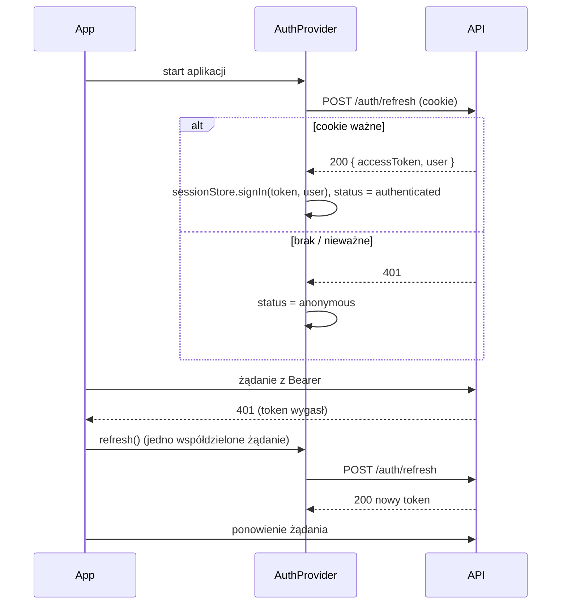

# Dane i uwierzytelnianie we frontendzie

> Klient API (orval), TanStack Query, przepływ logowania i odświeżania tokenu oraz obsługa błędów API. Czytaj w M10 i przy każdej pracy z danymi z API.
> Kontrakt: [ADR 0006](../../../docs/decisions/0006-openapi-contract-codegen.md). Tokeny po stronie API: [security.md](../../../docs/architecture/security.md).

## Klient API

- Źródło: `@klucznik/api-client` (workspace). Zawiera wygenerowane typy, funkcje i hooki TanStack Query: [packages/api-client/AGENTS.md](../../../packages/api-client/AGENTS.md).
- Konfiguracja raz, w `apps/web/src/api/client.ts`:

```ts
configureApiClient({
  baseUrl: import.meta.env.VITE_API_BASE_URL ?? '/api/v1', // zastępuje prefiks /api/v1 ścieżek z kontraktu
  getAccessToken: sessionStore.getAccessToken,
  refresh: refreshSession, // POST /auth/refresh pod blokadą Web Locks; zwraca nowy token lub null
  onUnauthorized: () => sessionStore.signOut(),
});
```

W developmencie Vite przekazuje `/api` do `localhost:3000` (proxy), a w produkcji robi to nginx, więc SPA i API mają jeden origin i ciasteczko `kl_refresh` (`Path=/api/v1/auth`, `SameSite=Strict`) działa bez CORS.

- Mutator (`packages/api-client/src/http/mutator.ts`) robi `fetch` z `credentials: 'include'` (cookie dla `/auth/*`), dokleja `Authorization` i parsuje błędy do `ApiError`.
- Nie piszemy własnych `fetch` do API. Brakujący endpoint zgłaszamy w [handoff.md](../../../docs/handoff.md).

## TanStack Query

| Ustawienie | Wartość |
|-|-|
| `staleTime` domyślny | 30 s (panel); strona publiczna: 5 min dla obiektu (`PUBLIC_PROPERTY_QUERY`), 1 min dla dostępności, zajętości i rezerwacji z linku (`PUBLIC_AVAILABILITY_QUERY`, `shared/lib/public-query.ts`) |
| `retry` | 1 dla zapytań; 0 dla mutacji; brak ponowień dla 4xx |
| `refetchOnWindowFocus` | `true` w panelu (świeże rezerwacje), `false` w publicznym |
| Klucze | z orval (`getListReservationsQueryKey(params)`) |

- Po mutacji unieważniamy powiązane klucze (np. potwierdzenie rezerwacji → lista rezerwacji, szczegóły, kalendarz, pulpit). Klucze orval mają postać `[ścieżka, params?]`, więc helpery w `shared/lib/invalidate.ts` (`invalidateReservations`, `invalidateRooms`, `invalidateAvailability`, `invalidateRates`, `invalidateProperty`) unieważniają po wzorcu ścieżki.
- Strona publiczna: po wysłaniu prośby o rezerwację, kolizji `409 RESERVATION_OVERLAP` (BR-01) i anulowaniu przez gościa `invalidatePublicAvailability` odświeża dostępność i zajętość obiektu. P3 i P2 używają tego samego klucza dostępności (`[ścieżka, { checkIn, checkOut, guests }]`), więc formularz nie pobiera ceny drugi raz.
- Token gościa (`/r/:token`) jest sekretem: nie trafia do tytułu karty ani logów, strona P5 ma meta `referrer` = `no-referrer` (linki do map nie wysyłają adresu z tokenem) i `robots` = `noindex`.
- Optymistyczne aktualizacje tylko dla prostych, odwracalnych operacji (np. kolejność zdjęć). Rezerwacje zawsze czekają na odpowiedź serwera.
- Paginacja: `placeholderData: keepPreviousData`.

## Przepływ uwierzytelniania



| Element | Implementacja |
|-|-|
| `sessionStore` (`src/api/session-store.ts`) | access token i stan sesji w pamięci modułu. Token nie trafia do `localStorage` ani `sessionStorage` |
| `AuthProvider` (`features/auth`) | stan `{ status: 'loading' \| 'authenticated' \| 'anonymous', user, endReason }` z `sessionStore` (`useSyncExternalStore`), akcje `signIn`, `logout`; bootstrap przy starcie: `refreshAccessToken()` |
| Single-flight refresh | w mutatorze (`refreshAccessToken`): trwający refresh jest współdzielony, a równoległe 401 czekają na ten sam `Promise` |
| Refresh w wielu kartach | `navigator.locks.request('kl-auth-refresh')`: karty odświeżają po kolei, a następna wysyła już nowe ciasteczko. Bez blokady dwie karty wysłałyby ten sam token, a API potraktowałoby drugie użycie jako kradzież i unieważniło wszystkie sesje ([security.md](../../../docs/architecture/security.md#refresh-token)) |
| Ponowienie | żądanie po 401 jest ponawiane raz. Drugie 401 albo nieudany refresh oznacza wylogowanie lokalne (`endReason: 'expired'`) i przekierowanie do `/logowanie?next=…` z komunikatem „Sesja wygasła” |
| Proaktywny refresh | nie w MVP (refresh dopiero po 401) |
| Wylogowanie | `POST /auth/logout`, `sessionStore.signOut('logout')`, `queryClient.clear()`, przekierowanie do `/logowanie` bez `next` |
| Wiele kart | `BroadcastChannel('kl-auth')` informuje inne karty o wylogowaniu |
| `?next=` | tylko ścieżka wewnętrzna (`safeNext`: zaczyna się od `/`, nie od `//`), żeby link logowania nie przekierował na obcą stronę |

## Obsługa błędów API

`ApiError` (z mutatora): `{ status, code, message, details, requestId }` zgodnie z [api-conventions.md](../../../docs/architecture/api-conventions.md#format-błędu).

**Mapa komunikatów** w `shared/lib/api-errors.ts` (`getErrorMessage`, lista `API_ERROR_CODES`). Jedno miejsce, klucz to `code`:

| `code` | Komunikat (domyślny) |
|-|-|
| `VALIDATION_ERROR` | „Sprawdź poprawność formularza.” + błędy przy polach |
| `INVALID_CREDENTIALS` | „Nieprawidłowy e-mail lub hasło” |
| `RATE_LIMITED` | „Zbyt wiele prób. Spróbuj ponownie za chwilę.” |
| `NOT_FOUND` | „Nie znaleziono – mogło zostać usunięte.” |
| `FORBIDDEN` | „Nie masz uprawnień do tej operacji.” |
| `RESERVATION_OVERLAP` | „Ten termin koliduje z inną rezerwacją” (+ numer z `details`) |
| `CAPACITY_EXCEEDED` | „Za dużo gości dla wybranego pokoju” |
| `MIN_NIGHTS_NOT_MET` | „Minimalny pobyt w tym terminie: {minNights} noce” |
| `INVALID_STAY_DATES` | wg `details.reason` (np. „Data przyjazdu nie może być w przeszłości”) |
| `INVALID_STATUS_TRANSITION` | „Tej operacji nie można wykonać w obecnym statusie rezerwacji” |
| `VERSION_CONFLICT` | „Ktoś w międzyczasie zmienił tę rezerwację – odśwież dane” |
| `CANCELLATION_DEADLINE_PASSED` | „Termin bezpłatnego anulowania minął – skontaktuj się z gospodarzem” |
| `SEASONAL_RATE_OVERLAP` | „Ta stawka nakłada się na stawkę „{conflictingRateName}”” |
| `HAS_FUTURE_RESERVATIONS` | „Nie można usunąć – istnieją przyszłe rezerwacje ({count})” |
| `INTERNAL_ERROR`, `UNKNOWN_ERROR` | „Coś poszło nie tak. Spróbuj ponownie” |
| `NETWORK_ERROR` (klient: brak połączenia) | „Brak połączenia z serwerem. Sprawdź internet i spróbuj ponownie.” |

Pozostałe kody z [business-rules.md](../../../docs/architecture/business-rules.md#podsumowanie) i [api-conventions.md](../../../docs/architecture/api-conventions.md#metody-i-kody-odpowiedzi) też muszą mieć wpis. Test sprawdza, że każdy znany kod ma komunikat.

**Gdzie pokazywać:**

| Sytuacja | Forma |
|-|-|
| `VALIDATION_ERROR` w formularzu | `applyFieldErrors` (`shared/lib/form-errors.ts`): pola z `details.fields` dostają polski komunikat „Nieprawidłowa wartość. Popraw to pole.” (komunikaty class-validator są techniczne, po angielsku), plus ogólny alert dla pól bez mapowania |
| Reguła biznesowa w formularzu (409/422) | alert inline nad przyciskiem zapisu |
| Akcja z listy lub drawera | toast błędu |
| Błąd ładowania widoku | `ErrorState` z „Spróbuj ponownie” (`refetch`) |
| `VERSION_CONFLICT` | alert z przyciskiem „Odśwież dane” |
| 5xx | toast z `requestId` w szczegółach (do zgłoszenia) |

## Formularze

- React Hook Form + `zodResolver`. Schematy w `features/<f>/schemas.ts`.
- Zod waliduje **kształt** (wymagane, formaty, długości) zgodnie z ograniczeniami DTO API. Reguł biznesowych nie duplikujemy (wyjątek: proste podpowiedzi, np. maks. liczba gości z `capacity`).
- Kwoty w formularzach w złotych (`MoneyInput`), a do API wysyłamy `toMinor(value)`.

## Mocki i testy

- MSW: handlery w `src/test/msw/handlers/<feature>.ts`, odpowiedzi typowane typami z `@klucznik/api-client`.
- Endpoint jeszcze niezaimplementowany w API: handler MSW + wpis w [handoff.md](../../../docs/handoff.md) do sesji `API`.
