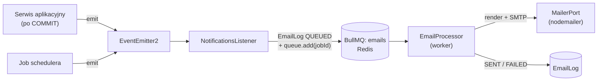

# Zdarzenia, kolejki i zadania cykliczne

> Mechanizmy asynchroniczne: zdarzenia domenowe (`@nestjs/event-emitter`), kolejka e-maili (BullMQ + Redis) i scheduler (`@nestjs/schedule`), wraz z zasadami idempotencji.
> Czytaj przy pracy nad etapem M9 i przy każdej zmianie, która ma wywołać e-mail. Decyzja: [ADR 0005](../decisions/0005-async-events-bullmq.md). Treść e-maili: [notifications.md](../features/notifications.md).

## Przepływ

Zasady:

- **Zdarzenia emitujemy dopiero po udanym commicie transakcji.** Serwis zbiera zdarzenia podczas operacji i emituje je po `prisma.$transaction(...)`. Wycofana transakcja nie wysyła e-maila.
- Listener jest cienki: nie wysyła e-maili sam, tylko tworzy `EmailLog` i dodaje job do kolejki. Dzięki temu błąd SMTP nie wpływa na odpowiedź HTTP.
- Moduły domenowe nie znają kolejki ani maila. Znają tylko klasy zdarzeń z `modules/<feature>/domain/events/`.

## Zdarzenia domenowe

| Zdarzenie | Emitent | Payload (min.) | E-maile ([szablony](../features/notifications.md#szablony)) |
|-|-|-|-|
| `ReservationCreated` | `ReservationService` (online i ręczna) | `reservationId`, `source`, `guestAccessToken?` (surowy) | `ONLINE`: `reservation-received` (gość) + `owner-new-reservation` (właściciel); `MANUAL` z e-mailem: `reservation-confirmed` (gość) |
| `ReservationConfirmed` | `ReservationService.confirm` | `reservationId`, `guestAccessToken?` | `reservation-confirmed` (gość) |
| `ReservationCancelled` | `ReservationService.cancel`, `GuestReservationService.cancel` | `reservationId`, `cancelledBy` | `reservation-cancelled` do gościa; gdy anulował gość, także `owner-reservation-cancelled` |
| `ReservationExpired` | `ExpirePendingReservationsJob` | `reservationId` | `reservation-expired` (gość) |
| `ReservationCompleted` | `CompleteStaysJob` | `reservationId` | brak (zdarzenie dla przyszłych opinii gości) |
| `StayReminderDue` | `SendStayRemindersJob` | `reservationId`, `guestAccessToken?` | `stay-reminder` (gość) |

Nazwy zdarzeń w EventEmitter: `reservation.created`, `reservation.confirmed` itd. Klasy zdarzeń to niemutowalne obiekty z polem `occurredAt`.

## Kolejka e-maili (BullMQ)

| Ustawienie | Wartość |
|-|-|
| Nazwa kolejki | `emails` |
| `jobId` | `EmailLog.idempotencyKey`. BullMQ nie doda duplikatu o tym samym `jobId` |
| Próby | `attempts: 5`, `backoff: { type: 'exponential', delay: 30_000 }` |
| Sprzątanie | `removeOnComplete: true`, `removeOnFail: 1000` |
| Współbieżność workera | 5 |
| Dane joba | `emailLogId`, `template`, `to`, `context` (dane do szablonu, w tym ewentualny link z tokenem) |

Worker (`EmailProcessor`):

1. pobiera `EmailLog`; jeśli `status = SENT`, kończy (idempotencja),
2. renderuje szablon Handlebars (`.hbs`, wspólny layout, po polsku),
3. wysyła przez `MailerPort`,
4. ustawia `SENT` + `sentAt` albo zwiększa `attempts`, zapisuje `lastError` i rzuca błąd, żeby BullMQ ponowił. Po ostatniej próbie ustawia `FAILED`.

Admin widzi logi w `GET /admin/email-logs` ([Q-07](../open-questions.md#q-07)).

## Scheduler

Wszystkie joby działają w strefie `Europe/Warsaw` (`@Cron(expr, { timeZone })`), a czas pobierają z `Clock`. Logika jest w serwisach aplikacyjnych, a klasa joba tylko je wywołuje, dzięki czemu testy integracyjne uruchamiają serwis bezpośrednio.

| Job | Harmonogram | Działanie | Reguła |
|-|-|-|-|
| `ExpirePendingReservationsJob` | co 15 min (`*/15 * * * *`) | `PENDING` z `expiresAt <= now` → `EXPIRED`, `ReservationEvent`, zdarzenie | BR-07 |
| `CompleteStaysJob` | codziennie 02:00 | `CONFIRMED` z `checkOut < today` → `COMPLETED` | maszyna stanów |
| `SendStayRemindersJob` | codziennie 09:00 | `CONFIRMED` z `checkIn = today + 2` i `reminderSentAt IS NULL` → zdarzenie, `reminderSentAt = now` | [Q-09](../open-questions.md#q-09) |

## Idempotencja

| Ryzyko | Ochrona |
|-|-|
| Job uruchomiony dwa razy lub na dwóch instancjach | zapis warunkowy `UPDATE … WHERE status = 'PENDING' AND expires_at <= now RETURNING id`. Zdarzenia emitujemy tylko dla faktycznie zmienionych wierszy |
| Podwójne przypomnienie | warunek `reminder_sent_at IS NULL` w tym samym `UPDATE` |
| Ten sam e-mail dodany dwa razy | `EmailLog.idempotencyKey` (UNIQUE) + `jobId` w BullMQ |
| Ponowienie joba po wysłaniu, gdy padł zapis statusu | worker sprawdza `status = SENT` przed wysyłką. Pozostałe ryzyko (podwójna wysyłka przy awarii między SMTP a zapisem) jest akceptowane |
| Wyścig: właściciel potwierdza, a job wygasza | oba zapisy są warunkowe po `status`; drugi dostaje 0 wierszy (BR-06) |

W MVP działa jedna instancja `api`. Przy skalowaniu poziomym joby cron trzeba uruchamiać na jednej instancji (np. BullMQ repeatable jobs albo blokada w Redisie). Zapisy warunkowe już teraz chronią przed duplikatami.

## Ponowne wysłanie linku z tokenem

Surowy token gościa istnieje tylko w chwili jego wygenerowania. Rekomendacja ([Q-16](../open-questions.md#q-16)): e-maile z linkiem (`reservation-received`, `reservation-confirmed`, `stay-reminder`) **generują nowy token** i nadpisują hash. Starsze linki przestają wtedy działać, a strona `/r/:token` pokazuje komunikat „Link jest nieaktualny – użyj linku z najnowszego e-maila”.

## Testowanie

- Unit: listener (mock kolejki) tworzy poprawny `EmailLog` i `jobId`; worker (mock `MailerPort`) obsługuje `SENT` i ponowienia.
- Integracja: joby schedulera wywołane bezpośrednio z fałszywym `Clock`; e-maile przechwytywane przez fake `MailerPort` lub Mailpit API w testach e2e.
