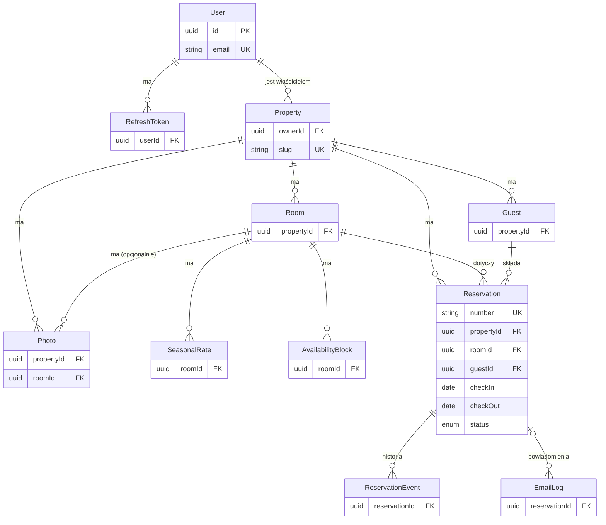
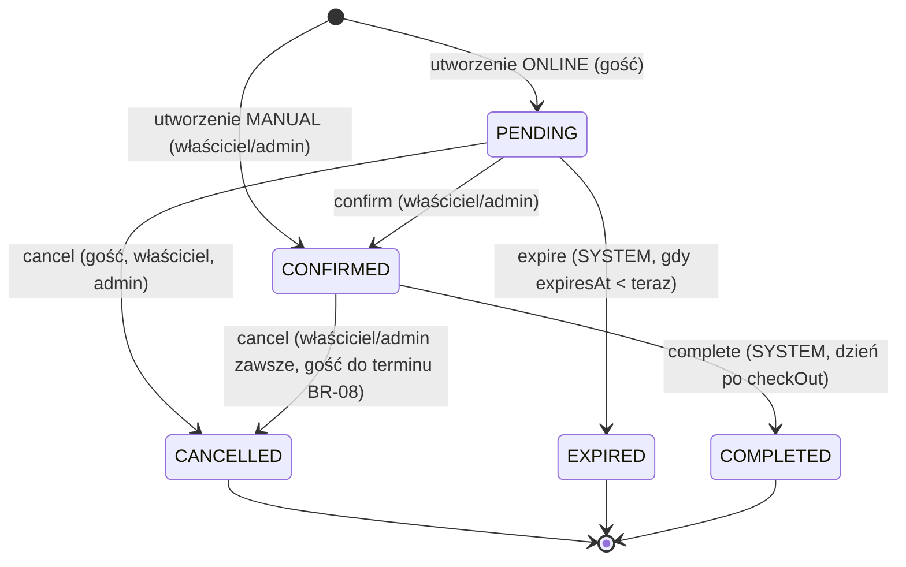

# Model danych

> Encje, pola, typy, relacje, indeksy, constrainty, ERD i maszyna stanów rezerwacji. Czytaj przed pracą nad schematem Prisma (M3) i przed każdą zmianą encji.
> Techniczne szczegóły Prismy (mapowanie nazw, migracje, seed): [persistence-layer.md](../../apps/api/docs/persistence-layer.md). Konwencje kwot i dat: [ADR 0007](../decisions/0007-money-and-dates.md).

## Konwencje

- Wszystkie `id` to UUID (`@default(uuid())`). Encje mają `createdAt` i `updatedAt` (`timestamptz`), chyba że zaznaczono inaczej.
- Modele Prismy w PascalCase, tabele w snake_case w liczbie mnogiej (`@@map`), kolumny w snake_case (`@map`).
- Kwoty to `Int` w groszach, waluta jest w osobnym polu (`PLN`).
- Daty pobytu i zakresy cennika lub blokad mają typ `DATE`, godziny są tekstem `HH:mm`.
- **Zakresy:** pobyt jest półotwarty `[checkIn, checkOut)`. Stawki sezonowe i blokady to zakresy **nocy włącznie** `[dateFrom, dateTo]`. Uzasadnienie i przykłady: [ADR 0007](../decisions/0007-money-and-dates.md).
- Soft delete (`deletedAt`) dotyczy `Property` i `Room`. Zapytania domyślnie pomijają usunięte rekordy.

## ERD



ERD pokazuje relacje i klucze (każda encja ma `id` UUID). Pełna lista pól jest w tabelach poniżej; `ReservationCounter` nie ma relacji.

## Encje

### User

| Pole | Typ | Uwagi |
|-|-|-|
| email | `String` UK | zapisywany małymi literami |
| passwordHash | `String` | argon2id |
| firstName, lastName | `String` | |
| role | `Role` (`ADMIN`, `OWNER`) | |
| isActive | `Boolean` = true | `false` blokuje logowanie i odświeżanie ([Q-10](../open-questions.md#q-10)) |

### RefreshToken

| Pole | Typ | Uwagi |
|-|-|-|
| userId | FK → User | indeks |
| tokenHash | `String` UK | SHA-256 losowego tokenu; surowy token jest tylko w ciasteczku |
| expiresAt | `timestamptz` | |
| revokedAt | `timestamptz?` | ustawiane przy rotacji, wylogowaniu i blokadzie konta |

Brak `updatedAt`. Przepływ: [security.md](security.md#refresh-token).

### Property (obiekt)

| Pole | Typ | Uwagi |
|-|-|-|
| ownerId | FK → User | indeks; podstawa izolacji (BR-12) |
| name | `String` | |
| slug | `String` UK | `[a-z0-9-]`, 3–60 znaków, publiczny URL `/o/:slug` |
| description | `String?` | tekst |
| street, postalCode, city | `String?` | adres ([Q-13](../open-questions.md#q-13)); wymagany w `POST /properties`, pusty dopuszczalny przy obiekcie zakładanym przez admina |
| phone, contactEmail | `String?` | kontakt widoczny dla gości |
| checkInTime, checkOutTime | `String` | `HH:mm`, domyślnie `15:00` i `11:00` |
| cancellationDeadlineDays | `Int` = 7 | BR-08 |
| pendingExpiryHours | `Int` = 48 | BR-07 |
| currency | `String` = `PLN` | waluta cennika obiektu |
| isActive | `Boolean` = true | nieaktywny obiekt: strona publiczna zwraca 404, rezerwacje online są niemożliwe (BR-13) |
| deletedAt | `timestamptz?` | soft delete (BR-10) |

### Room (pokój / domek)

| Pole | Typ | Uwagi |
|-|-|-|
| propertyId | FK → Property | indeks |
| name, description | `String`, `String?` | |
| capacity | `Int` ≥ 1 | BR-02 |
| basePricePerNight | `Int` ≥ 0 | grosze; BR-05 |
| minNights | `Int` ≥ 1 = 1 | BR-03 |
| isActive | `Boolean` = true | BR-13 |
| deletedAt | `timestamptz?` | BR-10 |

### Photo

| Pole | Typ | Uwagi |
|-|-|-|
| propertyId | FK → Property | zawsze ustawione, także dla zdjęć pokoju (izolacja) |
| roomId | FK → Room? | `null` oznacza zdjęcie obiektu |
| storageKey | `String` UK | `<uuid>.<ext>`, klucz w `StorageService` |
| mimeType, sizeBytes | `String`, `Int` | |
| sortOrder | `Int` | `0` = zdjęcie główne |
| altText | `String?` | |

Indeks `(propertyId, roomId, sortOrder)`. Brak `updatedAt`.

### SeasonalRate (stawka sezonowa)

| Pole | Typ | Uwagi |
|-|-|-|
| roomId | FK → Room | |
| name | `String` | np. „Wysoki sezon” |
| dateFrom, dateTo | `Date` | noce włącznie, `CHECK (date_to >= date_from)` |
| pricePerNight | `Int` ≥ 0 | grosze |
| minNights | `Int?` | nadpisuje `Room.minNights` (BR-03) |

Constraint BR-09 (ręczny SQL w migracji):
`EXCLUDE USING gist (room_id WITH =, daterange(date_from, date_to, '[]') WITH &&)`.

### AvailabilityBlock (blokada terminu)

| Pole | Typ | Uwagi |
|-|-|-|
| roomId | FK → Room | indeks `(roomId, dateFrom)` |
| dateFrom, dateTo | `Date` | noce włącznie, `CHECK (date_to >= date_from)` |
| reason | `String?` | np. „Remont” |

Blokady mogą nakładać się na siebie. Nie mogą kolidować z aktywną rezerwacją ([Q-15](../open-questions.md#q-15)). Brak `updatedAt`.

### Guest (gość)

| Pole | Typ | Uwagi |
|-|-|-|
| propertyId | FK → Property | goście są odizolowani per obiekt |
| firstName, lastName | `String` | |
| email | `String?` | małe litery; wymagany dla `ONLINE`, opcjonalny dla `MANUAL` ([Q-03](../open-questions.md#q-03)) |
| phone | `String?` | |

`UNIQUE (property_id, email)`, gdzie wiele wartości `NULL` jest dozwolonych. Indeks `(propertyId, lastName)`.

### Reservation (rezerwacja)

| Pole | Typ | Uwagi |
|-|-|-|
| number | `String` UK | `KL-RRRR-NNNNNN` z `ReservationCounter` ([Q-12](../open-questions.md#q-12)) |
| propertyId, roomId, guestId | FK | `propertyId` zdenormalizowany (izolacja, filtry) |
| checkIn, checkOut | `Date` | `CHECK (check_out > check_in)` |
| guestsCount | `Int` ≥ 1 | BR-02 |
| status | `ReservationStatus` | `PENDING`, `CONFIRMED`, `CANCELLED`, `EXPIRED`, `COMPLETED` |
| source | `ReservationSource` | `ONLINE`, `MANUAL` |
| totalPrice | `Int` | grosze, zamrożona przy utworzeniu (BR-05) |
| currency | `String` | kopia `Property.currency` |
| priceBreakdown | `Json` | `[{ "date": "2026-08-14", "price": 45000 }]` jako zamrożona kopia do widoku szczegółów |
| guestNotes, internalNotes | `String?` | |
| guestAccessTokenHash | `String?` UK | SHA-256; `null` gdy gość nie ma e-maila |
| expiresAt | `timestamptz?` | tylko dla `PENDING` (BR-07) |
| confirmedAt, cancelledAt | `timestamptz?` | |
| cancelledBy | `CancelledBy?` | `GUEST`, `OWNER`, `ADMIN`, `SYSTEM` |
| cancellationReason | `String?` | |
| reminderSentAt | `timestamptz?` | idempotencja przypomnień ([Q-09](../open-questions.md#q-09)) |
| version | `Int` = 1 | optimistic locking (BR-11) |

Indeksy: `(propertyId, checkIn)`, `(roomId, checkIn)`, `(status, expiresAt)`, `(guestId)`.

Constraint BR-01, czyli ostatnia linia obrony (rozszerzenie `btree_gist`, ręczny SQL w migracji):

```sql
ALTER TABLE reservations ADD CONSTRAINT reservations_no_overlap
  EXCLUDE USING gist (room_id WITH =, daterange(check_in, check_out, '[)') WITH &&)
  WHERE (status IN ('PENDING', 'CONFIRMED'));
```

### ReservationEvent (historia rezerwacji, [Q-05](../open-questions.md#q-05))

| Pole | Typ | Uwagi |
|-|-|-|
| reservationId | FK → Reservation | indeks |
| type | `ReservationEventType` | `CREATED`, `UPDATED`, `CONFIRMED`, `CANCELLED`, `EXPIRED`, `COMPLETED` |
| actorType | `ActorType` | `GUEST`, `OWNER`, `ADMIN`, `SYSTEM` |
| actorUserId | FK → User? | dla `OWNER` i `ADMIN` |
| payload | `Json?` | np. zmienione pola, powód anulowania |

Tylko `createdAt`. Wpis powstaje w tej samej transakcji co zmiana rezerwacji.

### EmailLog

| Pole | Typ | Uwagi |
|-|-|-|
| reservationId | FK → Reservation? | |
| recipient | `String` | |
| template | `String` | nazwa szablonu: [notifications.md](../features/notifications.md) |
| idempotencyKey | `String` UK | `<template>:<reservationId>[:<suffix>]`, chroni przed podwójną wysyłką |
| status | `EmailStatus` | `QUEUED`, `SENT`, `FAILED` |
| attempts | `Int` = 0 | |
| lastError | `String?` | |
| sentAt | `timestamptz?` | |

### ReservationCounter ([Q-12](../open-questions.md#q-12))

`year Int PK`, `lastValue Int`. Inkrementacja przez `INSERT … ON CONFLICT (year) DO UPDATE SET last_value = last_value + 1 RETURNING last_value` w transakcji tworzenia rezerwacji. Bez timestampów.

## Maszyna stanów rezerwacji

Implementacja: `apps/api/src/modules/reservations/domain/reservation-status.ts`, reguła BR-06.



| Przejście | Kto | Warunki | Skutki |
|-|-|-|-|
| → `PENDING` | gość | BR-01…05, BR-13 | `expiresAt = now + pendingExpiryHours`, token gościa |
| → `CONFIRMED` (ręczna) | `OWNER`/`ADMIN` | BR-01, BR-02, BR-13 (+ [Q-01](../open-questions.md#q-01)) | `confirmedAt = now` |
| `PENDING → CONFIRMED` | `OWNER`/`ADMIN` | `expiresAt > now` | `confirmedAt`, `expiresAt = null` |
| `PENDING → CANCELLED` | gość, `OWNER`, `ADMIN` | – | `cancelledAt`, `cancelledBy`, `expiresAt = null` |
| `PENDING → EXPIRED` | `SYSTEM` | `expiresAt <= now` | `expiresAt` zostaje dla historii |
| `CONFIRMED → CANCELLED` | `OWNER`/`ADMIN` zawsze, gość zgodnie z BR-08 | – | `cancelledAt`, `cancelledBy` |
| `CONFIRMED → COMPLETED` | `SYSTEM` | `checkOut < today` | – |

Każde przejście zwiększa `version` i zapisuje `ReservationEvent`.
