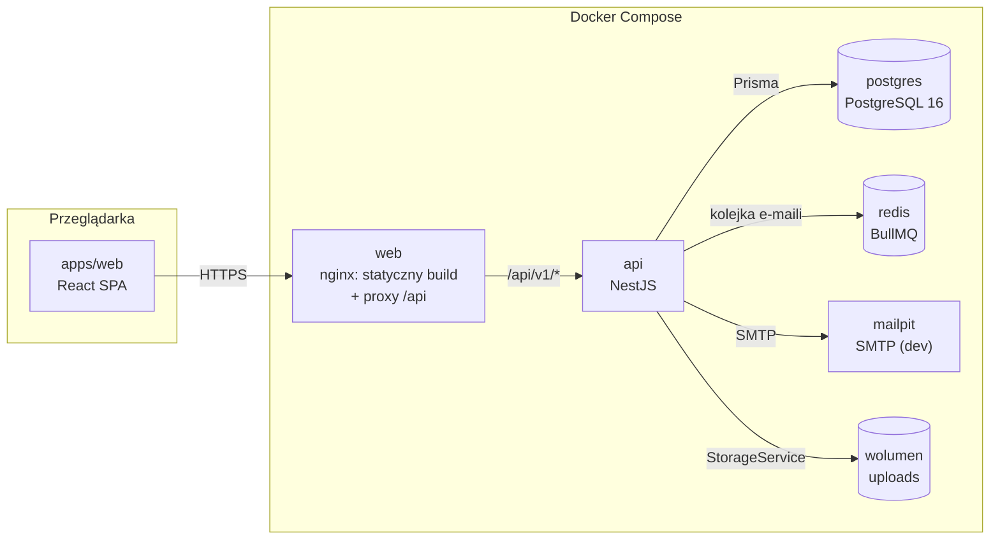
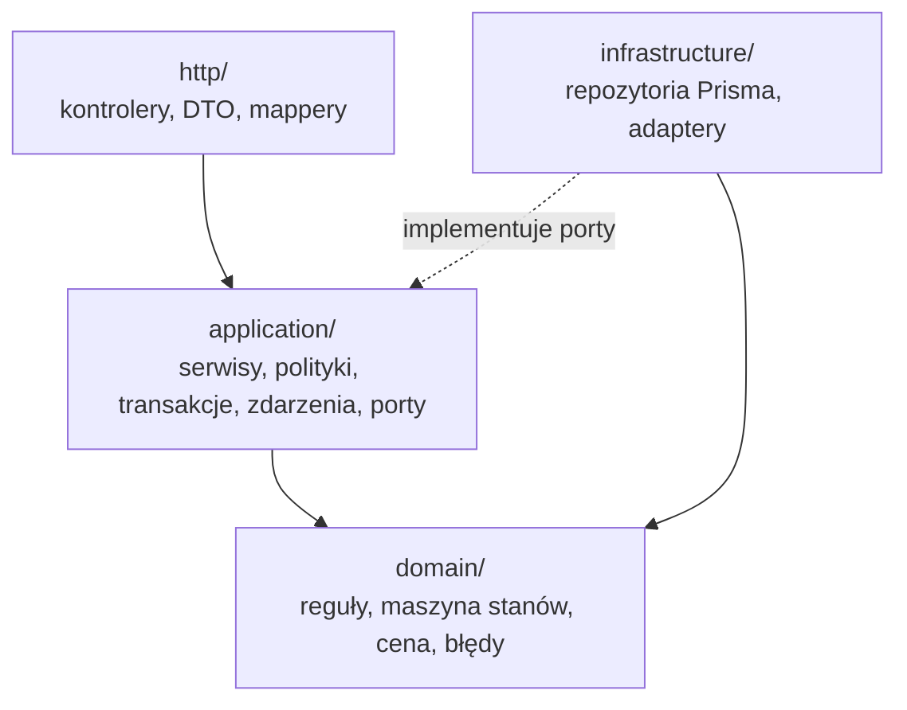

# Przegląd architektury

> Obraz całości: monorepo, komponenty, warstwy backendu, przepływ żądania i multi-tenancy. Czytaj na początku pracy nad projektem i przed obroną.
> Szczegóły warstw: [apps/api/docs/](../../apps/api/docs/) i [apps/web/docs/](../../apps/web/docs/).

## Monorepo

pnpm workspaces, TypeScript `strict` wszędzie, ESLint + Prettier, Node.js LTS: [ADR 0001](../decisions/0001-monorepo-pnpm.md).

| Pakiet | Nazwa | Rola |
|-|-|-|
| `apps/api` | `@klucznik/api` | REST API (NestJS, Prisma, PostgreSQL): [ADR 0002](../decisions/0002-nestjs-prisma-postgresql.md) |
| `apps/web` | `@klucznik/web` | SPA (React + Vite): [ADR 0003](../decisions/0003-react-vite-spa.md) |
| `packages/api-client` | `@klucznik/api-client` | `openapi.json` + klient wygenerowany przez orval: [ADR 0006](../decisions/0006-openapi-contract-codegen.md) |

## Diagram komponentów



- SPA i API działają pod **jednym originem**: nginx serwuje build i przekazuje `/api` do kontenera `api`. Dzięki temu ciasteczko refresh tokena jest first-party, a CORS jest potrzebny tylko w dev.
- Worker kolejki e-maili i scheduler działają w procesie `api` (MVP). Wydzielenie workera do osobnego kontenera nie wymaga zmian w kodzie modułów: [async-and-jobs.md](async-and-jobs.md).

## Warstwy backendu

Moduły są zorganizowane według funkcjonalności, a w każdym module obowiązuje podział na warstwy. Pełna struktura i checklisty: [apps/api/AGENTS.md](../../apps/api/AGENTS.md).



| Reguła zależności | Dlaczego |
|-|-|
| Kierunek: `http → application → domain` | logika biznesowa nie zależy od transportu |
| `application` używa `infrastructure` tylko przez porty (interfejsy + tokeny DI) | serwisy da się testować z fake'ami repozytoriów |
| `domain` to czysty TypeScript: bez NestJS, Prismy i HTTP | reguły testujemy jednostkowo bez frameworka |
| Kontrolery nie zawierają logiki ani zapytań do bazy | wymóg „logika oddzielona od HTTP” |
| Encje Prismy nigdy nie wychodzą z API, tylko DTO przez mapper | wymóg „DTO oddzielające API od bazy” |
| Błędy domenowe mapuje na HTTP jeden globalny filtr | jeden spójny format błędu: [api-conventions.md](api-conventions.md#format-błędu) |

## Przepływ żądania

Przykład: gość wysyła rezerwację (`POST /api/v1/public/properties/:slug/reservations`).

```mermaid
sequenceDiagram
  autonumber
  participant C as Klient (SPA)
  participant Ctl as Controller (http)
  participant S as ReservationService (application)
  participant D as Domain (reguły, cena)
  participant R as Repository (infrastructure)
  participant DB as PostgreSQL
  participant E as EventEmitter
  participant Q as BullMQ (Redis)
  participant W as EmailWorker

  C->>Ctl: POST + JSON body
  Note over Ctl: ThrottlerGuard, ValidationPipe (DTO)
  Ctl->>S: createOnline(command)
  S->>R: BEGIN; lock room (SELECT … FOR UPDATE)
  R->>DB: SQL
  S->>D: assertStayDates, capacity, minNights (BR-02..04, 13)
  S->>R: findCollisions(room, range) (BR-01)
  S->>D: calculatePrice(nights, rates) (BR-05)
  S->>R: insert reservation (PENDING, hash tokenu)
  R->>DB: INSERT; COMMIT (EXCLUDE constraint = ostatnia linia obrony)
  S-->>E: emit ReservationCreated (po commicie)
  S-->>Ctl: wynik
  Ctl-->>C: 201 Created + Location + DTO
  E->>Q: listener: EmailLog QUEUED + job
  Q->>W: job (z ponowieniami)
  W->>W: render Handlebars, wyślij SMTP, EmailLog SENT/FAILED
```

Błąd na dowolnym etapie (np. `ReservationOverlapError`) przerywa transakcję. Globalny filtr zamienia go na odpowiedź `409` w formacie z [api-conventions.md](api-conventions.md#format-błędu).

## Multi-tenancy

Jedna instancja i jedna baza obsługują wielu właścicieli. Tenantem jest **właściciel** (`User` z rolą `OWNER`), a granicą izolacji **obiekt** (`Property.ownerId`). Decyzja i alternatywy: [ADR 0008](../decisions/0008-multi-tenancy-ownership.md).

- Każdy zasób panelu jest powiązany z obiektem. `Reservation` i `Guest` mają `propertyId` wprost, `Room` przez `propertyId`, a pozostałe zasoby przez pokój.
- Serwisy aplikacyjne pobierają zasób **z filtrem własności** (`… WHERE property.ownerId = :userId`), chyba że użytkownik ma rolę `ADMIN`. Brak wyniku oznacza `404` (BR-12).
- Endpointy publiczne identyfikują obiekt po `slug` i zwracają tylko dane publiczne aktywnych obiektów.

## Frontend w skrócie

Jedna SPA z trzema obszarami: `/o/:slug` (publiczny, mobile-first), `/panel` (`OWNER`), `/admin` (`ADMIN`). Szczegóły: [apps/web/docs/architecture.md](../../apps/web/docs/architecture.md).

## Gotowość na rozszerzenia

| Funkcja „później” | Co w architekturze już to umożliwia |
|-|-|
| iCal z Booking/Airbnb | kolizje liczone wspólnie dla rezerwacji i blokad. Import iCal może tworzyć `AvailabilityBlock` z nowym `source`, a eksport korzysta z endpointu kalendarza |
| Płatności i zadatki | kwoty w groszach z walutą, zdarzenia domenowe (`ReservationCreated` → płatność), maszyna stanów gotowa na nowy stan |
| Samodzielna rejestracja, abonamenty | konta są niezależne od obiektów, a role są enumem |
| Wielu pracowników obiektu | własność sprawdzana w jednym miejscu (polityka dostępu), więc można ją rozszerzyć o tabelę członkostwa |
| Next.js dla stron obiektów | całe API publiczne pod `/public/**`, kontrakt OpenAPI i wygenerowany klient |
| Przechowywanie w S3 | port `StorageService` z implementacją dysku lokalnego |
| Wielojęzyczność | teksty UI w jednym miejscu, błędy API rozróżniane po `code`, nie po treści |
