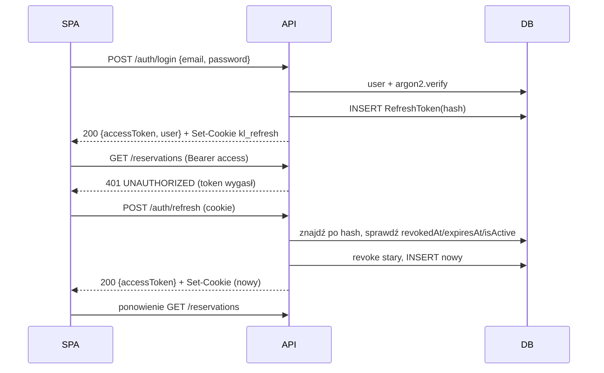

# Bezpieczeństwo

> Uwierzytelnianie (przepływ tokenów), autoryzacja (role i własność zasobu), token gościa, rate limiting, CORS, nagłówki, sekrety, upload.
> Czytaj przy pracy nad auth, guardami, endpointami publicznymi i konfiguracją. Decyzja: [ADR 0004](../decisions/0004-auth-jwt-refresh-cookie.md).

## Hasła

- Hashowanie **argon2id** (biblioteka `argon2`, parametry domyślne). Porównanie przez `argon2.verify`.
- Polityka hasła: min. 10 znaków. Hasło tymczasowe generuje admin przy zakładaniu konta ([admin-owners.md](../features/admin-owners.md)).
- Błąd logowania zawsze zwraca 401 `INVALID_CREDENTIALS`, także dla nieistniejącego e-maila i zablokowanego konta, żeby nie ułatwiać enumeracji kont.

## Access token

| Cecha | Wartość |
|-|-|
| Format | JWT HS256, sekret `JWT_ACCESS_SECRET` (min. 32 znaki) |
| Czas życia | `JWT_ACCESS_TTL`, domyślnie 15 min |
| Claims | `sub` (userId), `role`, `iat`, `exp` |
| Transport | nagłówek `Authorization: Bearer …` |
| Przechowywanie w SPA | **tylko w pamięci** (zmienna modułu), nigdy w `localStorage` |

`JwtAuthGuard` (globalny, wyłączany dekoratorem `@Public()`) weryfikuje podpis i `exp`. Aktywność konta jest sprawdzana przy refreshu, więc zablokowany użytkownik traci dostęp najpóźniej po wygaśnięciu access tokenu.

## Refresh token

| Cecha | Wartość |
|-|-|
| Format | losowe 32 bajty (base64url), **nieprzezroczyste** (nie JWT) |
| W bazie | tylko SHA-256 w `RefreshToken.tokenHash` |
| Czas życia | `REFRESH_TOKEN_TTL_DAYS`, domyślnie 7 dni |
| Ciasteczko | `kl_refresh`; `HttpOnly`, `Secure` (gdy `COOKIE_SECURE=true`), `SameSite=Strict`, `Path=/api/v1/auth` |
| Rotacja | każdy `POST /auth/refresh` unieważnia stary token (`revokedAt`) i wydaje nowy |
| Wykrycie ponownego użycia | użycie unieważnionego tokenu unieważnia **wszystkie** tokeny użytkownika (prawdopodobna kradzież) |
| Unieważnienie | `POST /auth/logout`, zablokowanie konta przez admina |

Po przeładowaniu strony SPA wywołuje `/auth/refresh`, żeby odzyskać sesję. Szczegóły po stronie frontendu: [data-and-auth.md](../../apps/web/docs/data-and-auth.md).
**CSRF:** ciasteczko jest wysyłane tylko do `/api/v1/auth/*`, ma `SameSite=Strict`, a SPA i API działają pod jednym originem. Endpointy zmieniające dane wymagają nagłówka `Authorization`, którego przeglądarka nie dołącza sama.

## Autoryzacja

Dwa niezależne poziomy (BR-12):

| Poziom | Mechanizm | Błąd |
|-|-|-|
| Rola | `RolesGuard` + `@Roles('ADMIN')` na kontrolerze lub metodzie | 403 `FORBIDDEN` |
| Własność zasobu | polityka w `application/` + zapytania z filtrem `ownerId` | 404 `NOT_FOUND` |

| Endpointy | Gość | `OWNER` | `ADMIN` |
|-|-|-|-|
| `/public/**`, `/files/**`, `/auth/login`, `/auth/refresh`, `/auth/logout` (cookie), `/health` | ✔ | ✔ | ✔ |
| `/auth/me` | – | ✔ | ✔ |
| `/properties/**`, `/rooms/**`, `/rates/**`, `/blocks/**`, `/photos/**`, `/reservations/**` | – | tylko własne | wszystkie |
| `/admin/**` | – | 403 | ✔ |

Własność sprawdzamy **w serwisie aplikacyjnym**, nie w kontrolerze, bo wymaga danych z bazy. Wzorzec: [application-layer.md](../../apps/api/docs/application-layer.md#polityki-dostępu), decyzja: [ADR 0008](../decisions/0008-multi-tenancy-ownership.md).

## Token gościa

- Generowany przy utworzeniu rezerwacji online, a także ręcznej, jeśli gość ma e-mail: `crypto.randomBytes(32)` w base64url.
- W bazie tylko `SHA-256` w `Reservation.guestAccessTokenHash`. Surowy token trafia **wyłącznie** do linku w e-mailu: `${APP_PUBLIC_URL}/r/<token>`.
- Wyszukiwanie: `GET /public/reservations/:token` → hash → rekord. Nieznany lub wygasły token → 404.
- Ważność: do `checkOut + 30 dni` ([Q-11](../open-questions.md#q-11)).
- Ponowne wysłanie linku w kolejnym e-mailu: [Q-16](../open-questions.md#q-16).
- Odpowiedź publiczna nie zawiera `internalNotes` ani danych innych rezerwacji.
- Raw token w danych joba BullMQ: dane w Redisie są w sieci wewnętrznej Dockera, a job jest usuwany po wysłaniu (`removeOnComplete`).

## Rate limiting

`@nestjs/throttler`, limit liczony per IP (za nginx: `trust proxy` + `X-Forwarded-For`).

| Zakres | Limit |
|-|-|
| globalny | `THROTTLE_LIMIT` żądań na `THROTTLE_TTL` s (domyślnie 100/60 s) |
| `POST /auth/login` | 5/min |
| `POST /auth/refresh` | 20/min |
| `GET /public/**` | 60/min |
| `POST /public/**` (rezerwacja, anulowanie) | 5/min |

Przekroczenie limitu → 429 `RATE_LIMITED`.

## Nagłówki, CORS, inne

- `helmet()` z domyślną konfiguracją. CSP ustawia nginx dla SPA: [infrastructure.md](infrastructure.md).
- CORS: domyślnie wyłączony, bo jest jeden origin. W dev biała lista z `CORS_ORIGINS` z `credentials: true`.
- `ValidationPipe({ whitelist: true, forbidNonWhitelisted: true, transform: true })` odrzuca nieznane pola, w tym próby przesłania ceny (BR-05) lub `ownerId`.
- Logi nie zawierają haseł, tokenów ani pełnych nagłówków `Authorization` i `Cookie`.

## Upload plików

- Dozwolone typy: `image/jpeg`, `image/png`, `image/webp`; rozmiar ≤ `UPLOAD_MAX_BYTES` (10 MB) ([Q-14](../open-questions.md#q-14)).
- Typ sprawdzamy po **sygnaturze pliku** (magic bytes), nie tylko po nagłówku `Content-Type`.
- Nazwa pliku jest generowana (`<uuid>.<ext>`), więc nazwa od klienta nigdy nie trafia na dysk. `GET /files/:storageKey` waliduje format klucza (brak path traversal).

## Sekrety

- Żadnych sekretów w repo. `.env` jest w `.gitignore`, a `.env.example` zawiera tylko nazwy zmiennych i bezpieczne wartości deweloperskie.
- Walidacja wszystkich zmiennych przy starcie (`@nestjs/config` + schemat); brak sekretu oznacza, że aplikacja nie startuje.
- CI używa GitHub Secrets lub wartości testowych generowanych w workflow. Lista zmiennych: [infrastructure.md](infrastructure.md#zmienne-środowiskowe).
- Konto admina w seedzie pochodzi z `SEED_ADMIN_EMAIL` i `SEED_ADMIN_PASSWORD`, nie z kodu.
