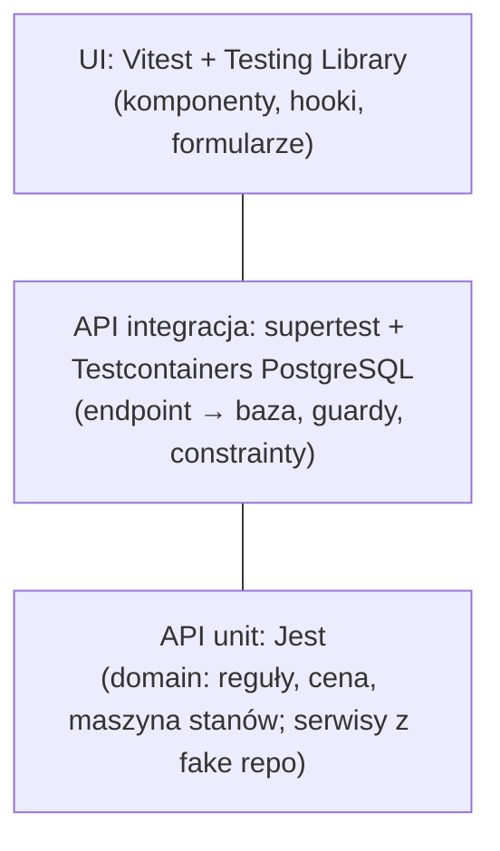

# Strategia testów

> Co testujemy, na jakim poziomie i jak nazywamy testy. Czytaj przed pisaniem testów w dowolnej warstwie i przy weryfikacji DoD.
> Lista reguł i przypisanych im testów: [business-rules.md](business-rules.md).

## Progi

| Wymóg przedmiotu (4.0/5.0) | Minimum | Nasz cel |
|-|-|-|
| Testy jednostkowe logiki biznesowej | 5 | każda reguła domenowa BR ma ≥ 1 test; łącznie ≥ 30 przypadków |
| Testy integracyjne REST API | 3 | ≥ 10 scenariuszy, w tym BR-01 (409), BR-12 (404/403), login |
| Testy najważniejszej logiki | wszystkie BR | wszystkie BR |

Pokrycie kodu nie jest celem samym w sobie. `domain/` powinno mieć ≥ 90% pokrycia linii, a dla reszty progu nie ustalamy.

## Piramida



| Poziom | Narzędzia | Co testujemy | Czego nie testujemy |
|-|-|-|-|
| Unit: domena | Jest, bez NestJS | czyste funkcje i reguły BR, granice dat, ceny, przejścia statusów | Prismy, HTTP |
| Unit: application | Jest + fake repozytoria w pamięci + `FixedClock` | orkiestrację: polityki dostępu, emisję zdarzeń, wywołania portów | SQL |
| Integracja API | Jest + supertest + Testcontainers (`postgres:16`) | pełne żądanie HTTP: walidacja, guardy, kody, format błędu, constrainty DB, migracje | zewnętrznego SMTP (fake `MailerPort`) |
| UI | Vitest + Testing Library + MSW | renderowanie stanów (ładowanie, pusty, błąd, sukces), formularze i walidację zod, mapowanie `code` → komunikat | wyglądu pikselowego |

## Lokalizacja i nazwy plików

| Rodzaj | Ścieżka | Komenda |
|-|-|-|
| API unit | obok kodu: `modules/<f>/domain/*.spec.ts`, `modules/<f>/application/*.spec.ts` | `pnpm --filter @klucznik/api test` |
| API integracja | `apps/api/test/integration/<feature>.e2e-spec.ts` | `pnpm --filter @klucznik/api test:int` |
| UI | obok kodu: `*.test.tsx` | `pnpm --filter @klucznik/web test` |

## Nazewnictwo testów z ID reguł

Test reguły zaczyna się od jej ID, dzięki czemu `grep "BR-01"` pokazuje wymaganie, implementację i testy.

```ts
describe('calculatePrice', () => {
  it('BR-05: sums seasonal and base price per night', () => { … });
});

describe('POST /public/properties/:slug/reservations', () => {
  it('BR-01: returns 409 RESERVATION_OVERLAP for overlapping stay', async () => { … });
});
```

Opisy testów piszemy po angielsku (kod), a ID reguły zawsze na początku.

## Testy integracyjne: zasady

- Jeden kontener PostgreSQL na przebieg (`globalSetup`), migracje przez `prisma migrate deploy`, więc constrainty `EXCLUDE` też są testowane.
- Izolacja między testami: `TRUNCATE … CASCADE` wszystkich tabel w `beforeEach` (helper `resetDatabase()`).
- Aplikacja Nest jest budowana z prawdziwym `AppModule`. Nadpisujemy tylko `Clock` (`FixedClock`), `MailerPort` (fake) i kolejkę (synchroniczny fake lub Redis z Testcontainers, gdy test dotyczy kolejki).
- Dane przez fabryki (`test/factories/*.ts`): `createOwner()`, `createProperty(owner)`, `createRoom(property, overrides)`, `loginAs(user)` → access token.
- W CI PostgreSQL jest dostępny jako service container. Zmienna `TEST_DATABASE_URL` pozwala pominąć Testcontainers: [infrastructure.md](infrastructure.md#ci).

## Minimalny zestaw scenariuszy integracyjnych (MVP)

| # | Scenariusz | Reguła | Etap |
|-|-|-|-|
| 1 | Login poprawny → 200 + cookie; złe hasło → 401 `INVALID_CREDENTIALS` | – | M4 |
| 2 | Refresh z rotacją; ponowne użycie starego tokenu → 401 i unieważnienie wszystkich | – | M4 |
| 3 | `OWNER` → `GET /admin/owners` → 403 | BR-12 | M4 |
| 4 | Owner B → zasób ownera A → 404 | BR-12 | M5 |
| 5 | `DELETE` pokoju z przyszłą rezerwacją → 409 | BR-10 | M7 |
| 6 | Nakładająca się stawka sezonowa → 409 | BR-09 | M6 |
| 7 | Rezerwacja na zajęty termin → 409; równoległe żądania → jedno 201 | BR-01 | M7 |
| 8 | Za dużo gości → 422 | BR-02 | M7 |
| 9 | `PATCH` z nieaktualną `version` → 409 | BR-11 | M7 |
| 10 | Gość anuluje po terminie → 422 | BR-08 | M8 |
| 11 | Job wygaszania → `EXPIRED`, termin wolny | BR-07 | M9 |
| 12 | Błąd walidacji → 400 w formacie `ErrorResponse` | – | M2 |

## Zegar w testach

Logika nigdy nie używa `new Date()` ani `Date.now()`, tylko `Clock` ([domain-layer.md](../../apps/api/docs/domain-layer.md#clock)). W testach `FixedClock.at('2026-08-01T10:00:00+02:00')`.

## Frontend

- MSW mockuje API na podstawie typów z `@klucznik/api-client`. Handlery są w `apps/web/src/test/msw/`.
- Każdy widok z danymi ma testy stanów: ładowanie, pusty, błąd (z przykładowym `code`) i sukces.
- Formularze: walidacja zod i mapowanie błędów `VALIDATION_ERROR.details.fields` na pola.
