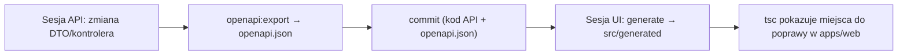

# packages/api-client: kontrakt API i wygenerowany klient

> Pakiet `@klucznik/api-client` zawiera kontrakt `openapi.json` (generowany z API) i klienta TypeScript (generowany przez orval). **Pliki generowane: nie edytuj ręcznie.**
> Decyzja i uzasadnienie: [ADR 0006](../../docs/decisions/0006-openapi-contract-codegen.md).

## Zawartość

```
packages/api-client/
  openapi.json              kontrakt – generuje sesja API (skrypt eksportu), commitowany
  orval.config.ts           konfiguracja generatora (tworzy sesja INFRA w M1, dostosowuje UI w M10)
  src/
    http/mutator.ts         ręcznie pisany fetch (konfigurowalny: baseUrl, token, refresh, błędy → ApiError)
    http/api-error.ts       klasa ApiError zgodna z formatem błędu API
    generated/              WYGENEROWANE przez orval: typy, funkcje, hooki TanStack Query – nie edytować
    index.ts                publiczny eksport (configureApiClient, ApiError, generated/*)
```

## Kto co zmienia

| Plik | Kto | Jak |
|-|-|-|
| `openapi.json` | sesja `API` | wyłącznie `pnpm --filter @klucznik/api openapi:export` |
| `src/generated/**` | sesja `UI` | wyłącznie `pnpm --filter @klucznik/api-client generate` |
| `src/http/**`, `index.ts` | sesja `UI` | ręcznie (mutator, błędy) |
| `orval.config.ts`, `package.json` | `INFRA` (M1), `UI` (M10) | ręcznie |

## Przepływ zmiany kontraktu



1. Sesja `API` zmienia endpoint, uruchamia eksport i commituje `openapi.json` **razem z kodem**. Jeśli zmiana łamie kontrakt używany przez UI, dodaje wpis do [handoff.md](../../docs/handoff.md) dla `UI`.
2. Sesja `UI` regeneruje klienta, poprawia błędy kompilacji w `apps/web` i commituje `src/generated` razem z poprawkami.
3. CI (`contract`) sprawdza, czy `openapi.json` odpowiada kodowi API i czy web kompiluje się z wygenerowanym klientem: [infrastructure.md](../../docs/architecture/infrastructure.md#ci).

## Konfiguracja orval (wytyczne)

- `input`: `./openapi.json`; `output.target`: `./src/generated`, `mode: 'tags-split'` (plik per tag = moduł API).
- `client: 'react-query'`, `httpClient: 'fetch'`, `override.mutator`: `./src/http/mutator.ts` (`customFetch`).
- `override.query`: `useQuery` i `useMutation` (bez `useInfinite`); `signal` przekazywany.
- Nazwy funkcji pochodzą z `operationId` (`Reservations_confirm` → `useReservationsConfirm`).
- `clean: true`, a po generowaniu Prettier.

## Zasady

- Typów z `src/generated` nie rozszerzamy ani nie nadpisujemy w `apps/web`. Gdy czegoś brakuje, poprawiamy dekoratory Swaggera w API (przez handoff).
- Pakiet nie importuje niczego z `apps/*`.
- Wersja pakietu nie jest publikowana do npm; używany przez `workspace:*`.
